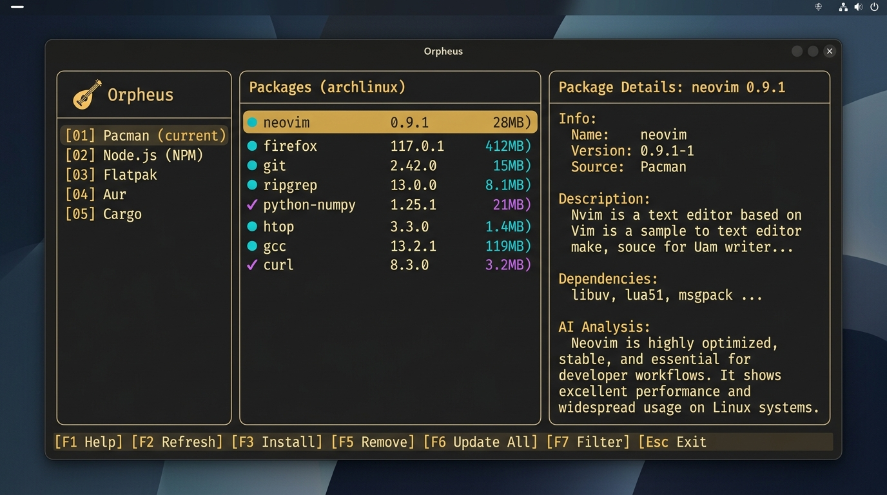

<div align="center">

# Orpheus

**A terminal-based package management dashboard for Arch Linux**

*Browse, inspect, AI-analyze, and batch-uninstall packages across multiple package managers — all from one beautiful TUI.*



[](https://go.dev)
[](https://archlinux.org)
[](https://github.com/charmbracelet/bubbletea)
[](https://groq.com)
[](#license)

</div>

---

## ✨ Why Orpheus?

Your Arch system accumulates packages over time. Some you installed months ago and forgot about. Some are 500 MB behemoths you used once. Some you're not even sure what they do anymore.

**Orpheus gives you clarity.** It pulls every explicitly installed package from Pacman, Flatpak, and npm into a single dashboard — then lets an AI tell you what's safe to remove.

---

## 🔥 Features

### 🖥️ Three-Panel Dashboard
A clean, vim-navigable interface with a **sidebar** for switching managers, a **package list** with virtual scrolling, and a **detail panel** with full package info and AI analysis.

### 📦 Multi-Manager Support
| Manager | What It Lists | Uninstall Strategy |
|---------|--------------|-------------------|
| **Pacman** | All explicitly installed packages (`pacman -Qi`) | `pacman -Rns --noconfirm` (recursive, removes configs) |
| **Flatpak** | All installed Flatpak applications | Removes app data + cleans unused runtimes |
| **npm** | Global npm packages with real disk sizes | `npm uninstall -g` |

### 🤖 AI-Powered Package Analysis
Press `a` on any package and Orpheus calls **Llama 3.3 70B** (via Groq) with full context about your system:
- **What** the package does on *your* machine
- **Why** you probably installed it (based on your other packages)
- **What happens** if you remove it
- **How to launch** it (provides the terminal command)

> The AI sees your entire list of explicit packages, so it can reason about relationships — e.g., knowing you have `neovim` helps it understand why `lua51` exists.

### ⚡ Yazi-Style Multi-Selection
- `Space` to toggle individual packages
- `v` to enter **visual mode** — select ranges by moving the cursor
- Batch-remove everything in one `sudo` call

### 🔍 Live Search & Sort
- `/` to fuzzy-search by name or description
- `s` to cycle sort: **Name → Size → Date**
- Scroll indicator shows your position in the list

### 💾 Persistent Cache
AI analysis results are cached to `~/.cache/orpheus/analysis.json` (formatted with `MarshalIndent` for easy `ripgrep` searching). Analyze once, read forever.

### 🎨 Gruvbox Dark Theme
Carefully crafted with the Gruvbox Dark palette — rounded borders, gold focus indicators, colored badges, and a context-sensitive status bar.

---

## 📸 Layout

```
╭──────────╮╭─────────────────────────╮╭──────────────────────╮
│ Orpheus  ││ Packages (142)  by Size ││ neovim               │
│          ││─────────────────────────││ 0.9.5                │
│ Packages ││  ● neovim       28.4MiB ││─────────────────────-│
│  > Pacman││  ● firefox     412.0MiB ││ Desc: Vim-fork fo... │
│    Flatpak│  ✓ htop          1.4MiB ││ Size: 28.4 MiB       │
│    Node  ││  ● gcc         119.0MiB ││ Date: Jan 15, 2026   │
│          ││  ● ripgrep       8.1MiB ││ Reason: Explicit     │
│          ││  ● curl          3.2MiB ││                      │
│          ││                         ││ AI Analysis:          │
│          ││                         ││ Neovim is your pri... │
│          ││                         ││                      │
│          ││                 3/142 2% ││ Verdict: [KEEP]      │
│          ││                         ││ (Command: nvim)      │
╰──────────╯╰─────────────────────────╯╰──────────────────────╯
 v/Spc select  j/k move  l/Enter open  s sort  / search  q quit
```

---

## ⌨️ Keybindings

Orpheus uses **vim-style navigation** throughout. The status bar always shows available keys for the current context.

### Navigation
| Key | Action |
|-----|--------|
| `j` / `k` | Move down / up |
| `h` / `l` | Focus left / right panel |
| `Ctrl+D` / `Ctrl+U` | Half-page down / up |
| `G` | Jump to bottom |
| `gg` | Jump to top |
| `Enter` / `l` | Open detail / enter panel |
| `Esc` / `h` | Back / exit mode |

### Selection
| Key | Action |
|-----|--------|
| `Space` | Toggle package selection |
| `v` | Visual mode — select a range |

### Actions
| Key | Action |
|-----|--------|
| `a` | AI analyze selected package |
| `x` | Remove selected package(s) |
| `/` | Search packages |
| `s` | Cycle sort mode |
| `r` | Reload package list |
| `q` | Quit |

---

## 🚀 Installation

### Prerequisites

- **Arch Linux** (or Arch-based distro)
- **Go 1.26+**
- **pacman** (comes with Arch)
- **node + npm** (optional, for npm package listing)
- **flatpak** (optional, for Flatpak support)

### Build from Source

```bash
git clone https://github.com/your-username/orpheus.git
cd orpheus
go build -o orpheus .
```

### Run

```bash
# Set up your Groq API key for AI analysis
echo "GROQ_API_KEY=your_key_here" > .env

# Launch
./orpheus
```

> **Tip:** Place the binary anywhere — Orpheus reads `.env` relative to the executable's location, not your working directory.

### Get a Groq API Key

1. Go to [console.groq.com](https://console.groq.com)
2. Create a free account
3. Generate an API key
4. Add it to your `.env` file

---

## 🏗️ Architecture

```
orpheus/
├── main.go                  # Entry point — .env loader, Bubble Tea bootstrap
│
└── internal/
    ├── ai/
    │   └── analyzer.go      # Groq API client — prompts, retry logic, response parsing
    │
    ├── cache/
    │   └── cache.go         # Thread-safe JSON file cache with RWMutex
    │
    ├── pm/                  # Package Manager abstraction
    │   ├── package.go       # Package struct + Manager interface
    │   ├── pacman.go        # pacman -Qi parser (state machine)
    │   ├── flatpak.go       # flatpak list parser + cleanup logic
    │   └── npm.go           # Inline Node.js script for global packages
    │
    └── tui/                 # Terminal UI
        ├── model.go         # Model struct, Init(), tea commands
        ├── msgs.go          # Bubble Tea message types
        ├── update.go        # Update() — all keybindings and logic
        ├── view.go          # View() — three-panel rendering
        └── styles.go        # Gruvbox Dark color palette + Lip Gloss styles
```

### Design Decisions

- **Explicit packages only** — Dependencies are hidden. You only see what *you* installed.
- **Context-aware AI** — The full list of your explicit packages is sent to the AI, so it can infer *why* something exists.
- **Single-command batch removal** — `pacman -Rns pkg1 pkg2 pkg3` in one `sudo` call, not N separate calls.
- **Flatpak cleanup** — Uninstalling a Flatpak also deletes its data and removes orphaned runtimes automatically.
- **No pip** — Modern Arch uses PEP 668 externally-managed environments, making system-wide pip unusable.

---

## 🎨 Theme

Orpheus uses the **Gruvbox Dark** color palette:

| Color | Hex | Usage |
|-------|-----|-------|
|  Base | `#282828` | Background |
|  Gold | `#d79921` | Focused borders |
|  Yellow | `#fabd2f` | Titles, keybinds, cursor |
|  Cyan | `#8ec07c` | Package badges, AI labels |
|  Purple | `#d3869b` | Selected checkmarks, spinner |
|  Green | `#b8bb26` | Safe verdict |
|  Red | `#fb4934` | Errors, warnings |
|  Light | `#ebdbb2` | Primary text |

---

## 🗺️ Roadmap

- [x] Pacman provider
- [x] npm provider
- [x] Flatpak provider (with `--delete-data` + `--unused` cleanup)
- [x] AI analysis with Groq/Llama 3.3 70B
- [x] AI launch commands (`Command: ...`)
- [x] Ripgrep-ready cache formatting
- [ ] 🔨 Ripgrep AI cache search (`?` keybind)
- [ ] Search & install via `yay` (background package cacher + instant search)
- [ ] Rust (`cargo`), Go, and pipx providers
- [ ] Global cross-manager search
- [ ] Package update commands
- [ ] Leftover config finder (`~/.config` orphan detection)
- [ ] "Who owns this file?" reverse lookup

---

## 🤝 Contributing

Contributions are welcome! The codebase is intentionally modular — adding a new package manager is as simple as implementing the `Manager` interface:

```go
type Manager interface {
    Name() string
    ListAll() ([]Package, error)
    GetPackage(name string) (*Package, error)
    UninstallCmd(names []string) []string
}
```

---

## 📄 License

MIT — do whatever you want with it.

---

<div align="center">

**Built with [Bubble Tea](https://github.com/charmbracelet/bubbletea) 🧋 and [Lip Gloss](https://github.com/charmbracelet/lipgloss) 💄**

*Orpheus — because your package list shouldn't be a mystery.*

</div>
